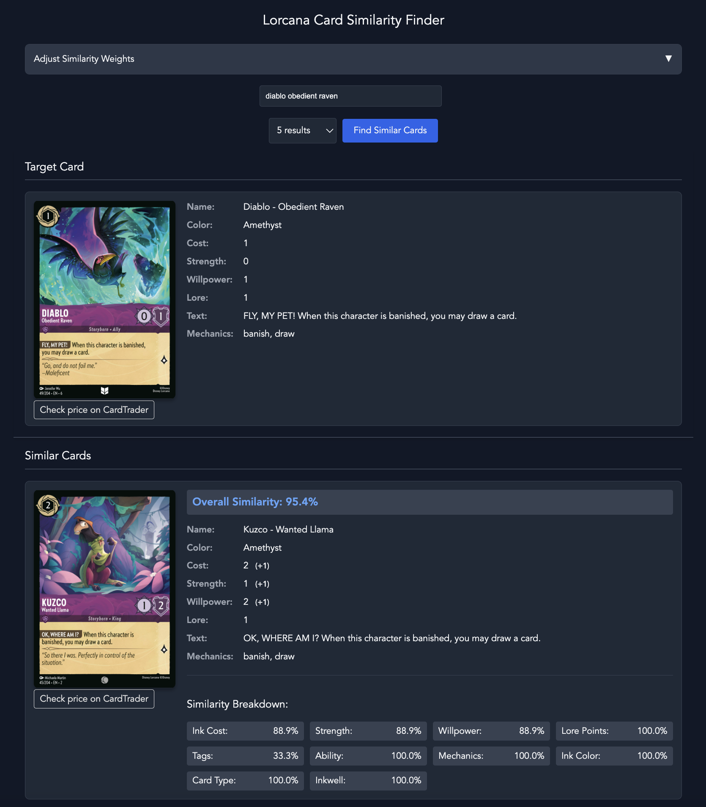

# Similcana

A web application for finding similar Lorcana cards based on various attributes and characteristics.




## Disclaimer

>This project is not affiliated with or endorsed by the creators of Lorcana. It is a personal project created for fun and to experiment with finding an easier way to find similar cards for deck building. 
>I'm not claiming this is good code, and it's provided as is. Feel free to use it for your own purposes, but I'm not responsible for any issues it may cause. 


## Features

- Find similar cards based on multiple attributes
- Adjustable similarity weights
- Interactive web interface
- Real-time card comparison
- Price checking integration with CardTrader

## Requirements

- Python 3.8+
- Dependencies listed in requirements.txt

## Installation

1. Clone the repository: 

```bash
git clone https://github.com/heavenideas/similcana.git
cd similcana
```

2. Install dependencies:

```bash
pip install -r requirements.txt
```
4. Ensure the database file is present:
- Place `allCards.json` in the `database/` directory

## Usage

1. Start the Flask application:

```bash
python app.py
```

2. Access the application in your web browser at `http://127.0.0.1:5000/`


## Project Structure

- `app.py`: Main Flask application
- `database/`: Database files
- `static/`: Static files (CSS, JavaScript)
- `templates/`: HTML templates
- `requirements.txt`: Project dependencies


## Contributing

1. Fork the repository
2. Create your feature branch (`git checkout -b feature/AmazingFeature`)
3. Commit your changes (`git commit -m 'Add some AmazingFeature'`)
4. Push to the branch (`git push origin feature/AmazingFeature`)
5. Open a Pull Request

## License

This project is licensed under the MIT License - see the LICENSE file for details.